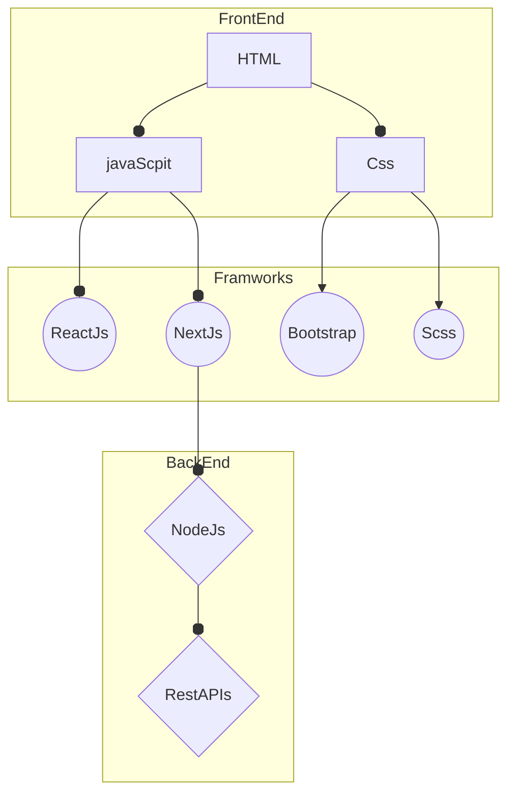

  

<h1 align="center">Hi, I'm Valentin Otero </h1>

  

## About Me

  <picture></picture>

  Soy estudiante de desarrollo de software y entusiasta de la tecnología. Me especializo en Java, JavaScript, HTML5, CSS3 y Python. Actualmente profundizando en frameworks de JavaScript y conceptos de algoritmos y estructuras de datos. Me motiva crear soluciones eficientes y aprender nuevas herramientas.

---

## My GitHub Stats

  

#### 🔧 Languages

#### 🔧 Tools

---
## Technologies 

  

